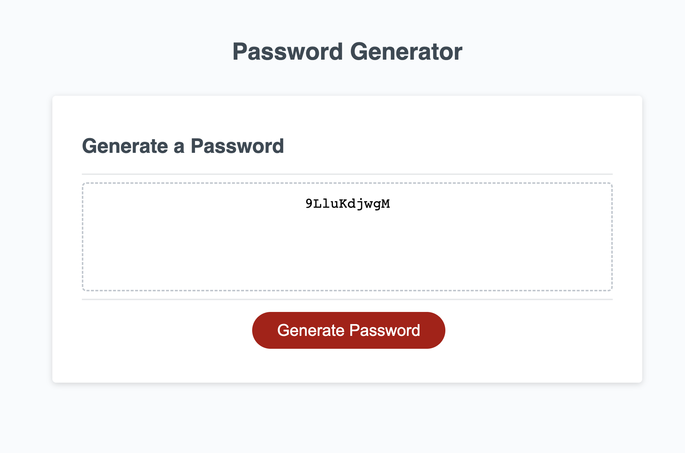

# week3PasswordGenerator

## Description
This is a simple JavaScript based password generator that allows you to create randomized passwords with customizable options. You can generate passwords ranging from 8 to 128 characters and toggle which character sets are included in the password.

## Features
Generate passwords with a length from 8 to 128 characters.
Include the use of these different character sets:
- Uppercase letters
- Lowercase letters
- Numbers
- Special characters

## How to Use
1. Clone this repository or download the password-generator.js file.

2. Include the password-generator.js file in your HTML document.

3. Create an HTML element (e.g., a button or input) to trigger the password generation.

3. Add an empty element where the generated password will be displayed.

4. Initialize the password generator and set your options.

5. Add an event listener to generate and display the password when the button is clicked.

6. Customize the password length by calling passwordGenerator.setLength(length) with your desired length.

7. To toggle the inclusion of character sets, use the provided methods.

[Link Text](https://github.com/loganlosee/week3PasswordGenerator)

[Link Text](https://loganlosee.github.io/week3PasswordGenerator/)

